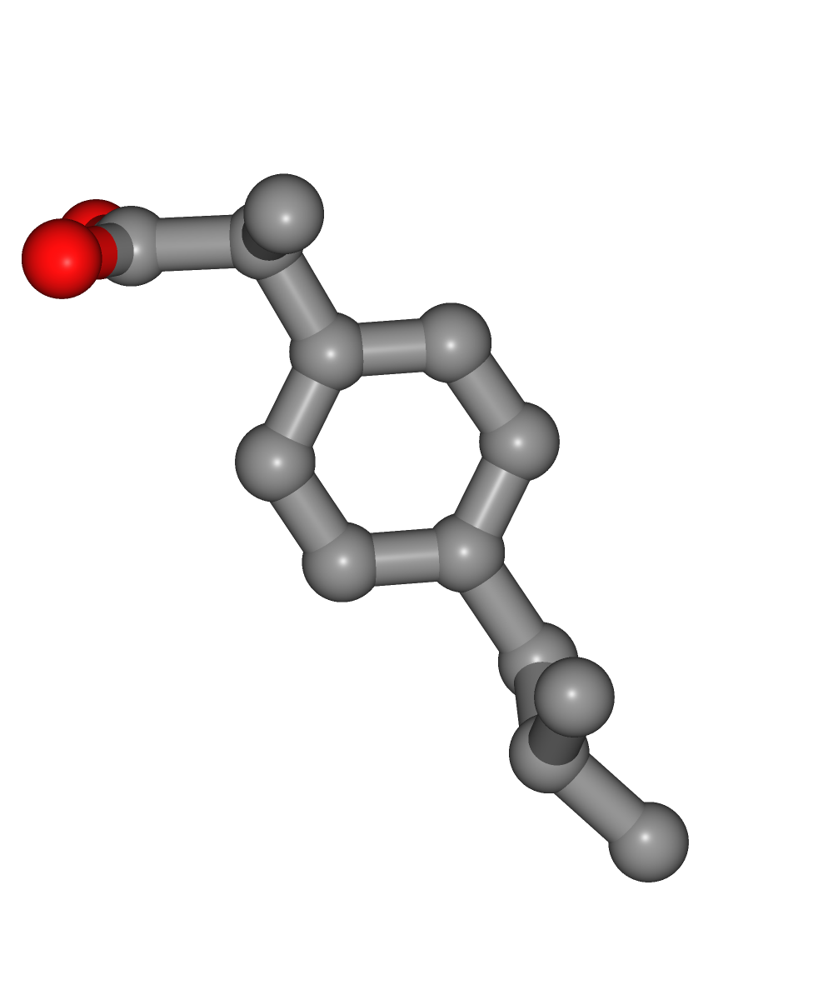
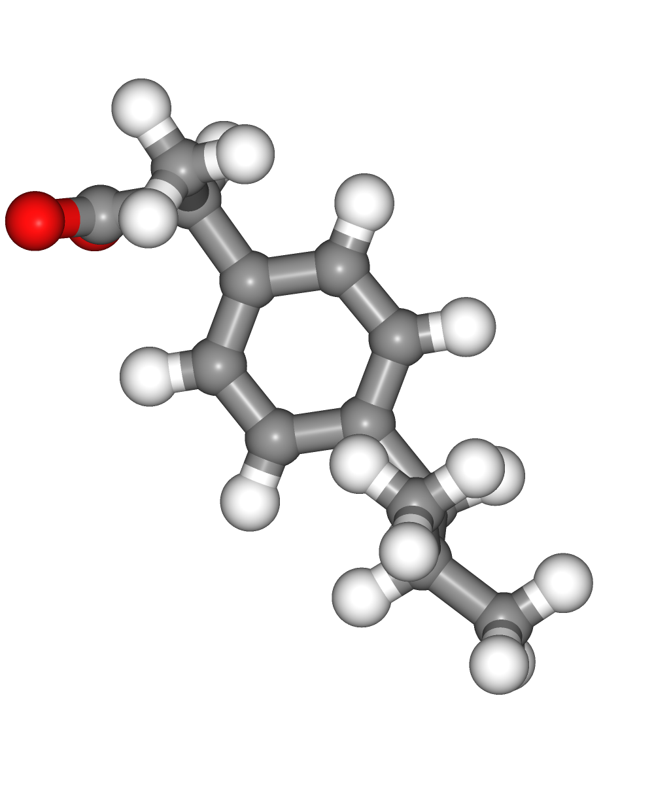
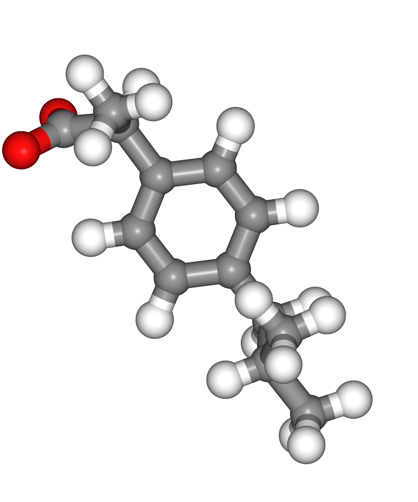

# Automatic Ligand parameterization tutorial using BioExcel Building Blocks (biobb)
***
This tutorial aims to illustrate the process of **ligand parameterization** for a **small molecule**, step by step, using the **BioExcel Building Blocks library (biobb)**. The particular example used is the **Ibuprofen** small compound (3-letter code IBP, Drugbank code [DB01050](https://www.drugbank.ca/drugs/DB01050)), a non-steroidal **anti-inflammatory drug** (NSAID) derived from propionic acid and it is considered the first of the propionics. 

**OpenBabel and ACPype** packages are used to **add hydrogens**, **energetically minimize the structure**, and 
**generate parameters** for the **GROMACS** package. With *Generalized Amber Force Field (GAFF)* forcefield and *AM1-BCC* charges.  
***
**Biobb modules** used:

 - [biobb_io](https://github.com/bioexcel/biobb_io): Tools to fetch data to be consumed by the rest of the Biobb building blocks.
 - [biobb_chemistry](https://github.com/bioexcel/biobb_chemistry): Tools to manipulate chemistry data.
 
### Auxiliary libraries used

* [jupyter](https://jupyter.org/): Free software, open standards, and web services for interactive computing across all programming languages.
* [nglview](http://nglviewer.org/#nglview): Jupyter/IPython widget to interactively view molecular structures and trajectories in notebooks.

### Conda Installation and Launch

```console
git clone https://github.com/bioexcel/biobb_wf_ligand_parameterization.git
cd biobb_wf_ligand_parameterization
conda env create -f conda_env/environment.yml
conda activate biobb_ligand_parameterization_tutorial
jupyter-notebook biobb_wf_ligand_parameterization/notebooks/biobb_ligand_parameterization_tutorial.ipynb
```

***
### Pipeline steps:
 1. [Input Parameters](#input)
 2. [Fetching Ligand Structure](#fetch)
 3. [Add Hydrogen Atoms](#addh)
 4. [Energetically Minimize Hydrogen Atoms](#min)
 5. [Generating Ligand Parameters](#acpype)
 6. [Output Files](#output)
 7. [Questions & Comments](#questions)
 
***

***

## Initializing colab
The two cells below are used only in case this notebook is executed via **Google Colab**. Take into account that, for running conda on **Google Colab**, the **condacolab** library must be installed. As [explained here](https://pypi.org/project/condacolab/), the installation requires a **kernel restart**, so when running this notebook in **Google Colab**, don't run all cells until this **installation** is properly **finished** and the **kernel** has **restarted**.


```python
# Only executed when using google colab
import sys
if 'google.colab' in sys.modules:
  import subprocess
  from pathlib import Path
  try:
    subprocess.run(["conda", "-V"], check=True)
  except FileNotFoundError:
    subprocess.run([sys.executable, "-m", "pip", "install", "condacolab"], check=True)
    import condacolab
    condacolab.install()
    # Clone repository
    repo_URL = "https://github.com/bioexcel/biobb_wf_ligand_parameterization.git"
    repo_name = Path(repo_URL).name.split('.')[0]
    if not Path(repo_name).exists():
      subprocess.run(["mamba", "install", "-y", "git"], check=True)
      subprocess.run(["git", "clone", repo_URL], check=True)
      print("⏬ Repository properly cloned.")
    # Install environment
    print("⏳ Creating environment...")
    env_file_path = f"{repo_name}/conda_env/environment.yml"
    subprocess.run(["mamba", "env", "update", "-n", "base", "-f", env_file_path], check=True)
    print("🎨 Install NGLView dependencies...")
    subprocess.run(["mamba", "install", "-y", "-c", "conda-forge", "nglview==3.0.8", "ipywidgets=7.7.2"], check=True)
    print("👍 Conda environment successfully created and updated.")
```


```python
# Enable widgets for colab
if 'google.colab' in sys.modules:
  from google.colab import output
  output.enable_custom_widget_manager()
  # Change working dir
  import os
  os.chdir("biobb_wf_ligand_parameterization/biobb_wf_ligand_parameterization/notebooks")
  print(f"📂 New working directory: {os.getcwd()}")
```

<a id="input"></a>
***
## Input parameters
**Input parameters** needed:
 - **ligandCode**: 3-letter code of the ligand structure (e.g. IBP, Drugbank code [DB01050](https://www.drugbank.ca/drugs/DB01050))
 - **mol_charge**: Molecule net charge (e.g. -1)
 - **pH**: Acidity or alkalinity for the small molecule. Hydrogen atoms will be added according to this pH. (e.g. 7.4)


```python
import nglview
import ipywidgets
import os

ligandCode = 'IBP'
mol_charge = 0
pH = 7.4
```

<a id="fetch"></a>
***
## Fetching ligand structure
Downloading **ligand structure** in **PDB format** from the IRB PDB MIRROR database.<br>
Alternatively, a **PDB file** can be used as starting structure. <br>
***
**Building Blocks** used:

 - [Ligand](https://biobb-io.readthedocs.io/en/latest/api.html#module-api.ligand) from **biobb_io.api.ligand**
***


```python
# Ligand: Download ligand structure from MMB PDB mirror REST API (https://mmb.irbbarcelona.org/api/)
# Import module
from biobb_io.api.ligand import ligand

# Create prop dict and inputs/outputs
input_structure = ligandCode + '.pdb'

prop = {
    'ligand_code' : ligandCode
}

#Create and launch bb
ligand(output_pdb_path=input_structure,
        properties=prop)
```

### Visualizing 3D structure
Visualizing the downloaded/given **ligand PDB structure** using **NGL**:    


```python
#Show small ligand structure
view = nglview.show_structure_file(input_structure)
view.add_representation(repr_type='ball+stick', selection='all')
view._remote_call('setSize', target='Widget', args=['','300px'])
view.camera='orthographic'
view
```

</img>

<a id="addh"></a>
***
## Add Hydrogen Atoms
Adding **Hydrogen atoms** to the small molecule, according to the given pH.
***
**Building Blocks** used:
 - [BabelAddHydrogens](https://biobb-chemistry.readthedocs.io/en/latest/babelm.html#module-babelm.babel_add_hydrogens) from **biobb_chemistry.babelm.babel_add_hydrogens** 
***


```python
# Babel_add_hydrogens: add Hydrogen atoms to a small molecule
# Import module
from biobb_chemistry.babelm.babel_add_hydrogens import babel_add_hydrogens

# Create prop dict and inputs/outputs
output_babel_h = ligandCode + '.H.mol2' 

prop = {
    'ph' : pH,
    'input_format' : 'pdb',
    'output_format' : 'mol2'
}

#Create and launch bb
babel_add_hydrogens(input_path=input_structure,
                  output_path=output_babel_h,
                  properties=prop)
```

### Visualizing 3D structure
Visualizing the **ligand PDB structure** with the newly added **hydrogen atoms** using **NGL**:    


```python
#Show small ligand structure
view = nglview.show_structure_file(output_babel_h)
view.add_representation(repr_type='ball+stick', selection='all')
view.camera='orthographic'
view
```

</img>

<a id="min"></a>
***
## Energetically minimize Hydrogen Atoms
Energetically minimize newly added **Hydrogen atoms**.
***
**Building Blocks** used:
 - [BabelMinimize](https://biobb-chemistry.readthedocs.io/en/latest/babelm.html#module-babelm.babel_minimize) from **biobb_chemistry.babelm.babel_minimize** 
***


```python
# Babel_minimize: Structure energy minimization of a small molecule after being modified adding hydrogen atoms
# Import module
from biobb_chemistry.babelm.babel_minimize import babel_minimize

# Create prop dict and inputs/outputs
output_babel_min = ligandCode + '.H.min.pdb'                              
prop = {
    'method' : 'sd',
    'criteria' : '1e-10',
    'force_field' : 'GAFF'
}


#Create and launch bb
babel_minimize(input_path=output_babel_h,
              output_path=output_babel_min,
              properties=prop)
```

### Visualizing 3D structure
Visualizing the **ligand PDB structure** with the newly added **hydrogen atoms**, **energetically minimized**, using **NGL**:    


```python
#Show small ligand structure
view = nglview.show_structure_file(output_babel_min)
view.add_representation(repr_type='ball+stick', selection='all')
view._remote_call('setSize', target='Widget', args=['','300px'])
view.camera='orthographic'
view
```

</img>

### Visualizing 3D structures
Visualizing all the structures generated so far:

 - Original **ligand PDB structure** (left)
 - **Ligand PDB structure** with **hydrogen atoms** (middle)
 - **Ligand PDB structure** with **hydrogen atoms energetically minimized** (right)  


```python
#Show different structures generated (for comparison)
view1 = nglview.show_structure_file(input_structure)
view1.add_representation(repr_type='ball+stick')
view1._remote_call('setSize', target='Widget', args=['250px','300px'])
view1.camera='orthographic'
view1
view2 = nglview.show_structure_file(output_babel_h)
view2.add_representation(repr_type='ball+stick')
view2._remote_call('setSize', target='Widget', args=['250px','300px'])
view2.camera='orthographic'
view2
view3 = nglview.show_structure_file(output_babel_min)
view3.add_representation(repr_type='ball+stick')
view3._remote_call('setSize', target='Widget', args=['250px','300px'])
view3.camera='orthographic'
view3
ipywidgets.HBox([view1, view2, view3])
```

</img></img></img>

<a id="acpype"></a>
***
## Generating ligand parameters
**Building GROMACS topology** corresponding to the **ligand structure**.

**Force field** used in this tutorial step is **amberGAFF**: [General AMBER Force Field](http://ambermd.org/antechamber/gaff.html), designed for rational drug design.

***
**Building Blocks** used:
- [AcpypeParamsGMX](https://biobb-chemistry.readthedocs.io/en/latest/acpype.html#module-acpype.acpype_params_gmx) from **biobb_chemistry.acpype.acpype_params_gmx** 
***


```python
# Acpype_params_gmx: Generation of topologies for GROMACS with ACPype
# Import module
from biobb_chemistry.acpype.acpype_params_gmx import acpype_params_gmx

# Create prop dict and inputs/outputs
output_acpype_gro = ligandCode + 'params.gro'
output_acpype_itp = ligandCode + 'params.itp'
output_acpype_top = ligandCode + 'params.top'
output_acpype = ligandCode + 'params'
prop = {
    'basename' : output_acpype,
    'charge' : mol_charge
}

#Create and launch bb
acpype_params_gmx(input_path=output_babel_min,
                output_path_gro=output_acpype_gro,
                output_path_itp=output_acpype_itp,
                output_path_top=output_acpype_top,
                properties=prop)
```

### Visualizing 3D structure
Visualizing the generated **GROMACS** gro structure corresponding to the parameterized **ligand PDB structure** using **NGL**:    


```python
#Show small ligand structure
view = nglview.show_structure_file(output_acpype_gro)
view.add_representation(repr_type='ball+stick', selection='all')
view._remote_call('setSize', target='Widget', args=['','300px'])
view.camera='orthographic'
view
```

</img>

<a id="output"></a>
## Output files

Important **Output files** generated:
 - {{output_acpype_gro}}: **Structure** of the parameterized ligand in gro (GROMACS) format.
 - {{output_acpype_top}}: **Topology** of the parameterized ligand, including a reference to the {{output_acpype_itp}}.
 - {{output_acpype_itp}}: **Include Topology File (itp)** of the parameterized ligand, including the parameters information: bonds, angles, dihedrals, etc.

***
<a id="questions"></a>

## Questions & Comments

Questions, issues, suggestions and comments are really welcome!

* GitHub issues:
    * [https://github.com/bioexcel/biobb](https://github.com/bioexcel/biobb)

* BioExcel forum:
    * [https://ask.bioexcel.eu/c/BioExcel-Building-Blocks-library](https://ask.bioexcel.eu/c/BioExcel-Building-Blocks-library)

